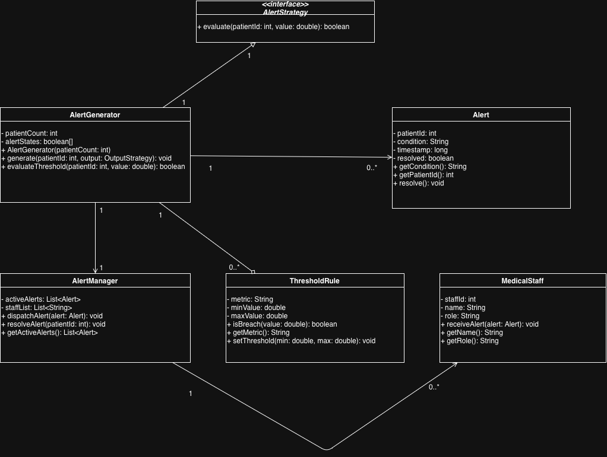
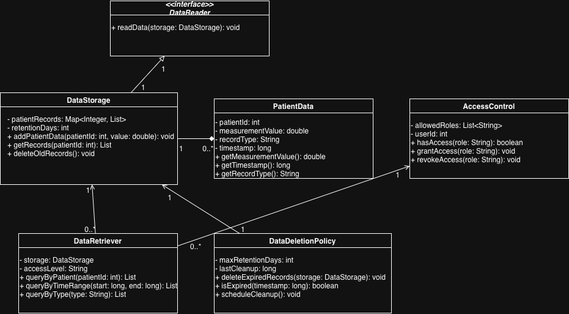

# Cardio Data Simulator

The Cardio Data Simulator is a Java-based application designed to simulate real-time cardiovascular data for multiple patients. This tool is particularly useful for educational purposes, enabling students to interact with real-time data streams of ECG, blood pressure, blood saturation, and other cardiovascular signals.

## Features

- Simulate real-time ECG, blood pressure, blood saturation, and blood levels data.
- Supports multiple output strategies:
  - Console output for direct observation.
  - File output for data persistence.
  - WebSocket and TCP output for networked data streaming.
- Configurable patient count and data generation rate.
- Randomized patient ID assignment for simulated data diversity.

## Getting Started

### Prerequisites

- Java JDK 11 or newer.
- Maven for managing dependencies and compiling the application.

### Installation

1. Clone the repository:

   ```sh
   git clone https://github.com/tpepels/signal_project.git
   ```

2. Navigate to the project directory:

   ```sh
   cd signal_project
   ```

3. Compile and package the application using Maven:
   ```sh
   mvn clean package
   ```
   This step compiles the source code and packages the application into an executable JAR file located in the `target/` directory.

### Running the Simulator

After packaging, you can run the simulator directly from the executable JAR:

```sh
java -jar target/6431280_6349291_cardio_data_simulator.jar
```

To run with specific options (e.g., to set the patient count and choose an output strategy):

```sh
java -jar target/6431280_6349291_cardio_data_simulator.jar --patient-count 100 --output file:./output
```

### Supported Output Options

- `console`: Directly prints the simulated data to the console.
- `file:<directory>`: Saves the simulated data to files within the specified directory.
- `websocket:<port>`: Streams the simulated data to WebSocket clients connected to the specified port.
- `tcp:<port>`: Streams the simulated data to TCP clients connected to the specified port.

## License

This project is licensed under the MIT License - see the [LICENSE](LICENSE) file for details.

## Project Members
- Student ID: 6431280 (Andrei Hoptiar)
- Student ID: 6349291 (Faisal Shadid)


## UML Diagrams

1.Alert Generation System

In the alert generation system, we wanted to ensure the code that checks the patient's vitals is separate from the code that generates the alert. The key class here is the AlertGenerator it takes in the patient's data and determines if it is outside the normal range. Rather than hard code the rules into this class, we used the Strategy design pattern with the AlertStrategy interface. So, if a doctor decides to use a new sort of rule (such as the trend of values instead of individual values), we can add another class without changing AlertGenerator. The ThresholdRule class allows each patient to have different minimum and maximum values for their vitals (such as heart rate), because patients vary in their "normal" ranges.
When a vital is outside of range, we create an Alert object. The Alert object contains the patient number, the alert and a time stamp to tell us when the problem occurred. The AlertManager then manages to send the alert to the right MedicalStaff member. We've separated AlertGenerator and AlertManager into two classes because one is responsible for generating alerts and the other for dispatching them. This makes each class responsible for one thing (single responsibility), making the system more flexible and testable.
The design is also reusable with the use of an interface and small, single-purpose classes. We could swap in another type of alert (such as an email) without changing the detection code.


2.Data Storage System

The data storage system is based on the principle that we need to store patient data securely, find it quickly, and remove it when we don't need it anymore. The primary interface is the DataStorage class. It stores patient data in a Map of patients, indexed by ID this is quick to look up because we often need to find records for a particular patient. The PatientData class has a single recording (such as a heart-rate reading), the record type, and a timestamp we want to know when each reading was recorded.
We created the DataReader interface because the storage might need to get data from multiple sources the Data Access Layer in Diagram 4 is one such source. This allows DataStorage not to know the specific type of reader. The class DataRetriever processes medical staff queries and allows them to filter by patient, by time, or by measurement. We separated this from DataStorage so that the storage and query aspects can remain separated; this is important for good design and for being able to change one aspect without affecting the other.
Since this system deals with patient data, we also created an AccessControl class. It verifies the user's role and returns only patient records if the user has access to patient records, as per the privacy requirement from the assignment. The last requirement is the data retention policy. It periodically cleans up records older than a certain age. This stops the storage from getting too big and helps the hospital comply with data retention standards.


3.Patient Identification System

In a hospital, all simulator measurements need to be associated with the right patient or it could be life-threatening. The PatientIdentifier class is responsible for mapping a simulator ID to a real HospitalPatient. We stored the simulator ID/hospital ID mappings in a Map so that they can be looked up easily.
So that this mapping is adaptable, we used the Strategy pattern with the IdentificationStrategy interface. This allows us to easily change the matching process, say from just ID matching now to name and date of birth matching in the future. The HospitalPatient class stores data like name, date of birth and medical history, while the PatientDatabase class stores the data and provides methods such as findById and addPatient. We split up HospitalPatient (data) and PatientDatabase (storage) because they do different things.
The IdentityManager class deals with complicated issues. If it cannot find a patient ID in the database, then it creates a MismatchRecord recording why and at what time. Now the system doesn't crash and we can record problems so they can be looked into. The verifyIntegrity method is also there to ensure mappings are still valid, in case the patient information is modified. In general, we separated the matching, storage and error handling so that each can be changed separately.


4.Data Access Layer

This diagram is a model for how the simulator data gets into the system. The project description said that data can come in via TCP, WebSocket or file, so we wanted to design something that can work with any of those three without the rest of the system having to know what is being used. So we created a DataListener abstract class that provides the methods connect, disconnect and startListening. The three subclasses (TCPDataListener, WebSocketDataListener, and FileDataListener) all extend DataListener and provide their own versions of the methods. By using inheritance we can later add another source, like an HTTP API, by just defining another subclass, without changing the code that is already working.
We also need to convert data from its raw form. The DataParser class takes care of this. It receives a raw string (which could be JSON, CSV or any other data format), works out what it is, checks it, and returns a nice PatientData object. We wanted to separate the parser from the listeners one class deals with getting the data off the wire, the other class deals with making sense of it. This makes it easier to debug and test.
And the DataSourceAdapter glues it all together. It has a listener and a parser and passes the parsed data on to the storage system (the system in Diagram 2). The adapter is the interface between the "outside world" and CHMS, and prevents the storage or alert systems from knowing how the data comes in. If we change protocols, only this part of the system needs to change.