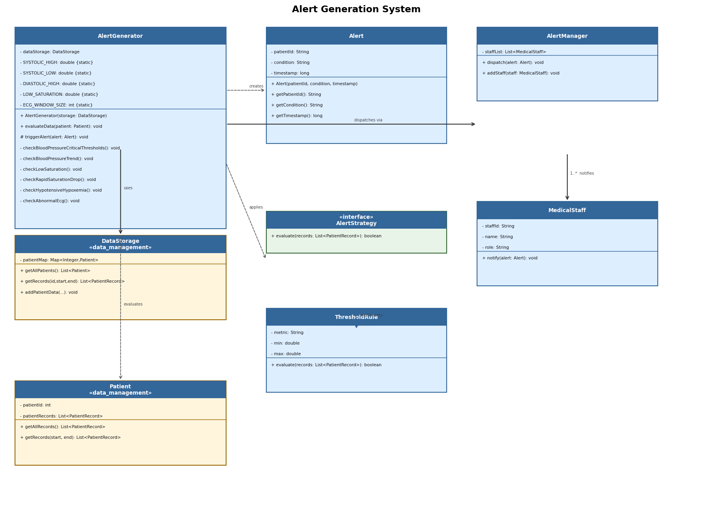
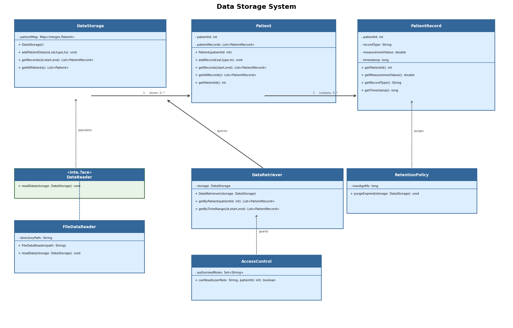
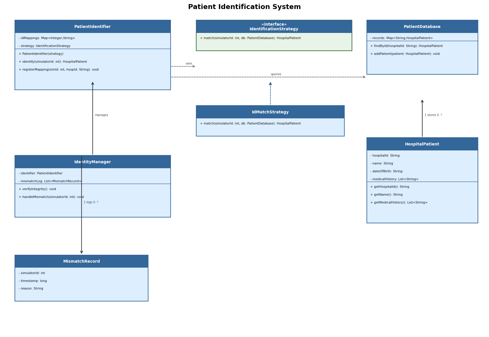
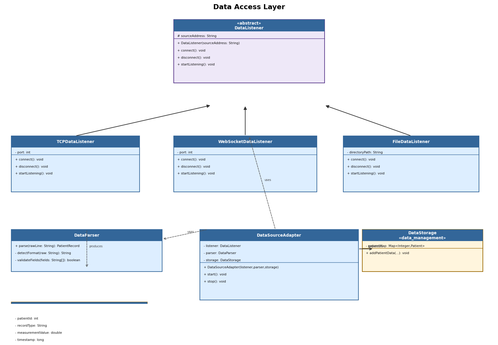

# Cardio Data Simulator

The Cardio Data Simulator is a Java-based application designed to simulate real-time cardiovascular data for multiple patients. This tool is particularly useful for educational purposes, enabling students to interact with real-time data streams of ECG, blood pressure, blood saturation, and other cardiovascular signals.

## Features

- Simulate real-time ECG, blood pressure, blood saturation, and blood levels data.
- Supports multiple output strategies:
  - Console output for direct observation.
  - File output for data persistence.
  - WebSocket and TCP output for networked data streaming.
- Configurable patient count and data generation rate.
- Randomized patient ID assignment for simulated data diversity.

## Getting Started

### Prerequisites

- Java JDK 11 or newer.
- Maven for managing dependencies and compiling the application.

### Installation

1. Clone the repository:

   ```sh
   git clone https://github.com/AndreiHoptiar/signal_project-Faisdrei-.git
   ```

2. Navigate to the project directory:

   ```sh
   cd signal_project-Faisdrei-
   ```

3. Compile and package the application using Maven:
   ```sh
   mvn clean package
   ```
   This step compiles the source code and packages the application into an executable JAR file located in the `target/` directory.

### Running the Simulator

After packaging, you can run the simulator directly from the executable JAR:

```sh
java -jar target/6431280_6349291_cardio_data_simulator.jar
```

To run with specific options (e.g., to set the patient count and choose an output strategy):

```sh
java -jar target/6431280_6349291_cardio_data_simulator.jar --patient-count 100 --output file:./output
```

### Supported Output Options

- `console`: Directly prints the simulated data to the console.
- `file:<directory>`: Saves the simulated data to files within the specified directory.
- `websocket:<port>`: Streams the simulated data to WebSocket clients connected to the specified port.
- `tcp:<port>`: Streams the simulated data to TCP clients connected to the specified port.

## License

This project is licensed under the MIT License - see the [LICENSE](LICENSE) file for details.

## Project Members
- Student ID: 6431280 (Andrei Hoptiar)
- Student ID: 6349291 (Faisal Shadid)

---

## UML Diagrams

All UML diagrams are located in the [`uml_models/`](uml_models/) directory.
PlantUML source files (`.puml`) are included alongside the PNG exports so the
diagrams can be re-rendered at any time (e.g. with the IntelliJ PlantUML plugin).

### 1. Alert Generation System



The alert generation system separates *detecting* a dangerous condition from
*dispatching* the resulting alert. `AlertGenerator` holds a reference to
`DataStorage` (to retrieve patient records) and to a `Patient` object it is
currently evaluating — satisfying the feedback requirement that the diagram
connects to both data storage and patient identification. Each alert rule is
a private helper method, following the Single Responsibility principle.

When a rule fires, an `Alert` object (patient ID, condition string, timestamp)
is handed to `AlertManager`, which holds a `List<MedicalStaff>` (corrected
from the earlier `List<String>`) and notifies the appropriate staff member.
The `AlertStrategy` interface with `ThresholdRule` as a concrete implementation
allows per-patient threshold customisation without modifying `AlertGenerator`.

### 2. Data Storage System



`DataStorage` is the central repository, holding a map of `Patient` objects
each of which owns a list of `PatientRecord` entries. The `DataReader` interface
decouples the storage from its input source; `FileDataReader` is the provided
implementation. `DataRetriever` handles staff queries (by patient or time range)
and is gated by `AccessControl`, which checks user roles before returning
records. A `RetentionPolicy` class periodically purges records older than a
configured maximum age.

### 3. Patient Identification System



`PatientIdentifier` maps incoming simulator IDs to `HospitalPatient` records
stored in `PatientDatabase`. It delegates the matching logic to
`IdentificationStrategy` (Strategy pattern), currently implemented by
`IdMatchStrategy`. `IdentityManager` oversees the whole process: it calls
`verifyIntegrity()` periodically and logs any unresolvable IDs as
`MismatchRecord` entries so failures can be investigated without crashing
the system.

### 4. Data Access Layer



`DataListener` is an abstract class with three concrete subclasses —
`TCPDataListener`, `WebSocketDataListener`, and `FileDataListener` — covering
all three output modes supported by the simulator. `DataParser` converts a raw
text line into a `PatientRecord`, detecting the format and validating fields
before returning a typed object. `DataSourceAdapter` composes a listener and a
parser and pushes parsed records into `DataStorage`, acting as the single seam
between the external world and the rest of CHMS.
